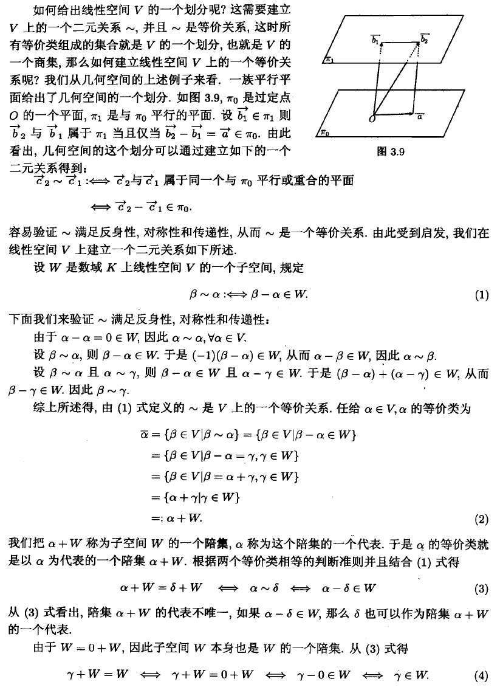

### 商空间 (quotient space)

商空间的本质如何理解？ - belupreda的回答 - 知乎 https://www.zhihu.com/question/52574116/answer/205757445

---

一句话解释清楚:给定一个子空间W，商空间就是**与W平行**的“平直”空间的**集合**。
如果你恍然大悟的话，不用继续看。

下面再继续解释。
首先说说线性空间，大白话就是：线性空间是过原点的”平直”空间。

平直这个词是直觉上的说法，你就想象一下直线或者平面吧。
因为过原点，所以线性空间满足加法与数乘的封闭性。

现在问题来了：不过原点的平直空间不满足封闭性，不能称为线性空间，该怎么称呼它们？答案：商空间里的一个元素。

再看定义：k={α + W|，α  是向量，W是线性空间}。所以，商空间就是把线性空间平移了一下形成一个元素，这些元素的集合组成了商空间。见下图：

上图中，虽然每一条不过原点的线不是线性空间。但把这些线，包括过原点的线，看成一个个元素，这些元素的加与数乘运算却满足封闭性，组成了一个线性空间。

从集合划分的角度来看，商空间就是按一定方向，平行的划分出了无数等价类。所以又可标记为V/W

最后说一点：所有线性方程的解，如果有解，就是商空间里的一个元素。形象的理解就是，线性方程的解是从某一点出发，在固定的方向上平直运动。

在群论里，商集的意思和商空间对应。群的子群H，对应W。陪集aH与{α + W}对应，代表元a与α对应。

---

[对话中的一些问题]

商空间是封闭的，我前面写的有误。不封闭的是指商空间里的一个元素里内容。商空间里的元素就是与W平行的‘空间’，但这些‘空间’不过原点，所以不封闭。

说个简单的线性空间例子：过原点的直线 y=x ,任何在这条直线上的向量都可以看成(a,a)的形式，任何两个向量运算也是(a,a)的形式。这就是封闭性。 另外一条直线  y=x+1，就不是线性空间，因为任何两个向量是(a,a+1)的形式，比如向量1：(2,3)与(3,4)相加是(5,7)这点跑到这条直线外了，也就是不封闭了。y=x+1就是商空间。

判断是不是线性空间，直观的看就是：是不是过原点。

再说下明白：y=x+1是可以表达为商空间的形式a+W,a取(0,1),W取k(b,b)形式就可。再罗嗦下：线性空间是商空间的特例

---

