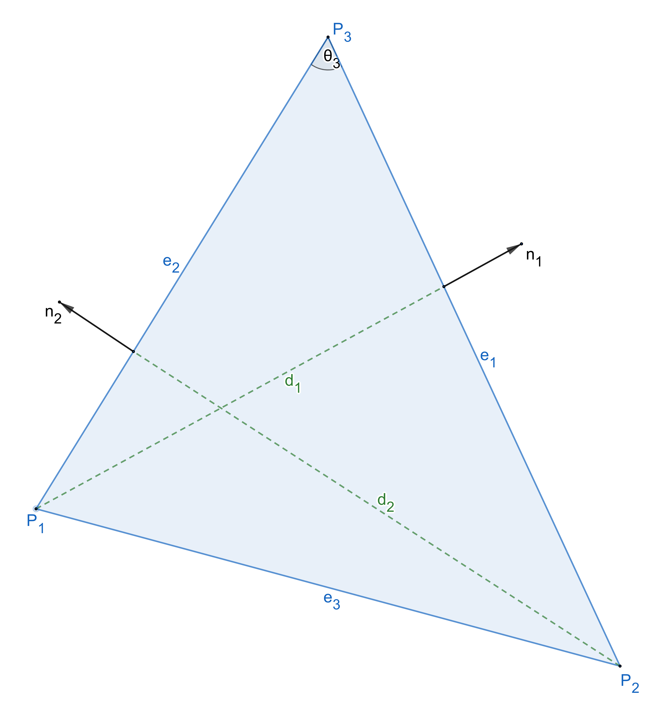

# ch2

---

We consider the $$2D$$ case:
$$
\begin{bmatrix}
&x_1 \ \ &x_2 \ \ &x_3 \\
&y_1 \ \ &y_2 \ \ &y_3 \\
&1 \ \ &1 \ \ &1 
\end{bmatrix} 
\begin{bmatrix}
\lambda_1 \\
\lambda_2 \\
\lambda_3
\end{bmatrix} = 
\begin{bmatrix}
x \\
y \\
1
\end{bmatrix},
$$
this gives us $$\lambda_1+\lambda_2+\lambda_3 = 1$$, and 
$$
\begin{align}
&x = \lambda_1 x_1 + \lambda_2 x_2 + (1-\lambda_1-\lambda_2) x_3, \\
&y = \lambda_1 y_1 + \lambda_2 y_2 + (1-\lambda_1-\lambda_2) y_3.
\end{align}
$$
Rearranging, this is 
$$
\begin{align}
& \lambda_1(x_1-x_3)+\lambda_2(x_2-x_3)+ x_3 - x = 0, \\
& \lambda_1(y_1-y_3)+\lambda_2(y_2-y_3)+ y_3 - y = 0.
\end{align}
$$
Let $$\mathbf r = [x, y]^T,\ \mathbf r_i = [x_i, y_i]^T (i = 1,2,3)$$, and $$\pmb \lambda = [\lambda_1, \lambda_2]^T$$. The above linear transformation may be written more succinctly as
$$
\mathbf T \pmb \lambda = \mathbf r - \mathbf r_3, \text{ where }\ \mathbf T = [\mathbf r_1 - \mathbf r_3, \ \mathbf r_2 - \mathbf r_3],
$$
thus $$\pmb \lambda = \mathbf T^{-1} (\mathbf r - \mathbf r_3)$$, and we have 
$$
\begin{align}
\lambda_1 &= \frac{\rm det([\mathbf r - \mathbf r_3, \ \mathbf r_2 - \mathbf r_3])}{\rm det(\mathbf T)} = \frac{(y_2 - y_3)(x-x_3) - (x_2-x_3)(y-y_3)}{(y_2 - y_3)(x_1-x_3) - (x_2-x_3)(y_1-y_3)}, \\
\lambda_2 &= \frac{\rm det([\mathbf r_1 - \mathbf r_3, \ \mathbf r - \mathbf r_3])}{\rm det(\mathbf T)} = \frac{(x_1-x_3)(y-y_3) - (y_1 - y_3)(x-x_3)}{(y_2 - y_3)(x_1-x_3) - (x_2-x_3)(y_1-y_3)}, \\
\lambda_3 &= 1 - \lambda_1 - \lambda_2.
\end{align}
$$

---

1. Todo:

   

2. In this exercise, we give explicit formula of the stiffness matrix. Let $$\tau$$ be a triangle with vertices $$\pmb x_1, \pmb x_2, \pmb x_3$$ and let $$\lambda_1, \lambda_2, \lambda_3$$ be corresponding barycentric coordinates. See the figure 

   

   Google: barycentric coordinate in finite element method

   See: [wiki- barycentric system](https://en.wikipedia.org/wiki/Barycentric_coordinate_system)

   http://www.iue.tuwien.ac.at/phd/nentchev/node26.html

   - Let $$\pmb n_i$$ be the outward normal vector of edge $$e_i$$ and $$d_i$$ be the distance from $$\pmb x_i$$ to $$e_i$$. Prove that
     $$
     \nabla \lambda_i = -\frac{1}{d_i}\pmb n_i.
     $$
     **Proof**: From the expression of $$\lambda_1, \lambda_2, \lambda_3$$, we only give the $$\nabla \lambda_1$$,
     $$
     \nabla \lambda_1 = \begin{bmatrix} \frac{(y_2 - y_3)}{\rm det(\mathbf T)}\\ 
     \frac{-(x_2 - x_3)}{\rm det(\mathbf T)}
     \end{bmatrix} = \frac{1}{\rm det(\mathbf T)}\begin{bmatrix} y_2 - y_3\\ 
     -(x_2 - x_3)
     \end{bmatrix} ,
     $$
     The edge $$\vec{e_1} = [x_3-x_2, y_3-y_2]^T$$, we can esaily get that $$\pmb n_1 = \frac{1}{|\vec{e_1}|}[y_3-y_2,-(x_3-x_2)]^T$$. Thus, we have 
     $$
     \nabla \lambda_1 = -\frac{|\vec{e_1} |\pmb n_1 }{\rm det(\mathbf T)},
     $$
     also, we use the area of triangle: $$\frac{1}{2}{\rm{det}(\mathbf T)} = \frac{1}{2} |\vec{e_1} | d_1$$, so $$|\vec{e_1}| = \frac{\rm det(\mathbf T)}{d_1}$$. We finally get $$\nabla \lambda_i = -\frac{1}{d_i}\pmb n_i$$.

     ---

   - Let $$\theta_i$$ be the angle associated to the vertex $$\pmb x_i$$. Prove that 
     $$
     \int_\tau \nabla \lambda_i\cdot \nabla\lambda_j {\rm d} x = -\frac{1}{2}\cot \theta_k,
     $$
     where $$(i,j,k)$$ is any permutation of $$(1,2,3)$$.

     **Proof**: We only prove $$\int_\tau \nabla \lambda_1\cdot \nabla\lambda_2 {\rm d} x = -\frac{1}{2}\cot \theta_3$$. It is easy to check that the angle between $$\pmb n_1$$, $$\pmb n_2$$ is $$\pi-\theta_3$$. So 
     $$
     \int_\tau \nabla \lambda_1\cdot \nabla\lambda_2 = \int_\tau (-\frac{1}{d_1}\pmb n_1)\cdot (-\frac{1}{d_2}\pmb n_2) = \frac{\cos(\pi - \theta_3)}{d_1 d_2} \int_\tau {\rm d}x = \frac{-\cos(\theta_3)}{d_1 d_2} |\tau|.
     $$
     Moreover, we have the following relationships
     $$
     d_1 = |\vec{e_2}|\sin\theta_3, \quad d_2 = |\vec{e_1}|\sin\theta_3, \quad |\tau| = \frac{1}{2}|\vec{e_1}|d_1 = \frac{1}{2}|\vec{e_1}||\vec{e_2}|\sin\theta_3.
     $$
     By taking the relationships into the equation, we have $$\int_\tau \nabla \lambda_1\cdot \nabla\lambda_2 {\rm d} x = -\frac{1}{2}\cot \theta_3$$.

     Now, we see how to compute $$\int_\tau \nabla \lambda_1\cdot \nabla\lambda_1$$, we should use the different relationship of $$d_1$$ as follows
     $$
     d_1 = |\vec{e_2}|\sin\theta_3, \quad d_1 = |\vec{e_3}|\sin\theta_2, \quad |\tau| = \frac{1}{2}|\vec{e_3}|d_3 = \frac{1}{2}|\vec{e_3}||\vec{e_2}|\sin\theta_1.
     $$

     $$
     \int_\tau \nabla \lambda_1\cdot \nabla\lambda_1 = \frac{1}{d_1 d_1}|\tau| = \frac{\frac{1}{2}|\vec{e_3}||\vec{e_2}|\sin\theta_1}{|\vec{e_2}|\sin\theta_3 |\vec{e_3}|\sin\theta_2} = \frac{1}{2}\frac{\sin(\pi - \theta_2-\theta_3)}{\sin\theta_3 \sin\theta_2},
     $$

     finally, by using $$\sin(\pi - \theta_2-\theta_3) = \sin\theta_2 \cos\theta_3 + \cos\theta_2\sin\theta_3$$, 
     $$
     \int_\tau \nabla \lambda_1\cdot \nabla\lambda_1 = \frac{1}{2}(\cot\theta_2+\cot\theta_3).
     $$

     ---

   - Let $$c_i = \cot\theta_i, i=1,2,3$$. If we define the local stiffness matrix $$\pmb A_\tau$$ as $$3\times 3$$ matrix formed by $$\int_\tau \nabla\lambda_i\cdot\nabla\lambda_j {\rm d}x, \ i,j = 1,2,3$$. Show that
     $$
     \pmb A_\tau = \frac{1}{2}\begin{bmatrix}
     &c_2+c_3 \quad &-c_3 \quad &-c_2 \\
     &-c_3 \quad &c_3+c_1 \quad &-c_1 \\
     &-c_2 \quad &-c_1 \quad &c_1+c_2
     \end{bmatrix}.
     $$
     **Proof**: We get the result directly from the derivation in the upper question.

     ---

   - Let $$e$$ be an interior edge in the trianglulation $$\mathcal T$$ with nodes $$x_i$$ and $$x_j$$, and shared by two triangles $$\tau_1$$ and $$\tau_2$$. Denoted 

