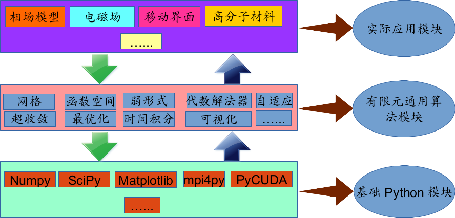
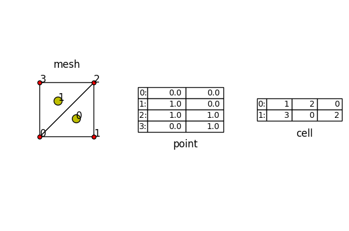
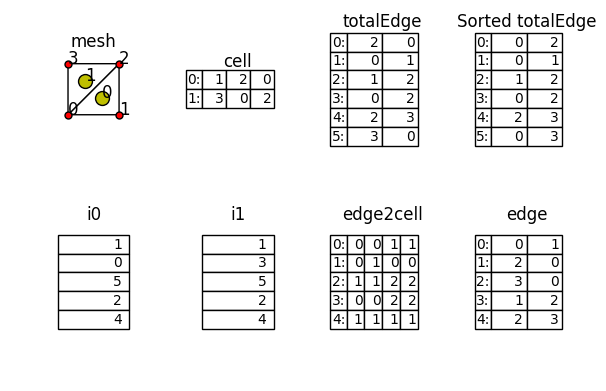
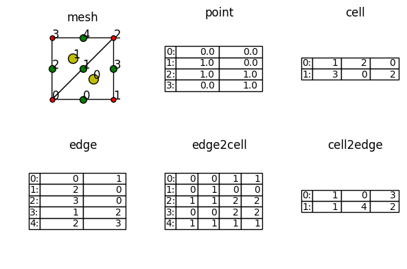
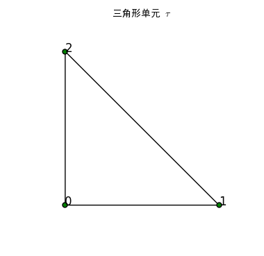
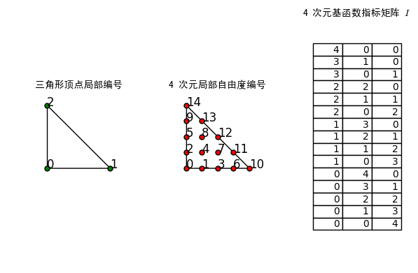

## FEALPy: Finite  Element Analysis Library in Python

* This file is from `fealpy/doc/fealpybook/基于 Numpy 的面向数组有限元编程技术.ipynb`, and rename `基于 Numpy 的面向数组有限元编程技术.ipynb` by `FEALPy.ipynb`, then by using `ipython nbconvert --to markdown FEALPy.ipynb`, we can convert `FEALPy.ipynb` to `FEALPy.md`.
* FEALPy is a finite element method analysis library in Python, the details see [FEALPy](https://github.com/weihuayi/fealpy).


## FEALPy 的架构设计



## FEALPy 中已经实现的功能

* 基础的网格数据结构、算法和可视化功能，包括二维的三角形、四边形和多边形，三维的四面体、六面体和多面体网格的数据结构；
* 简单区域上的三角形网格生成算法，二维的界面拟合网格生成算法，曲面三角形网格生成；
* 三角形网格的二分法加密算法。
* 基于四叉树和八叉树的数据结构和加密粗化算法，在加密和粗化时，不再要求相邻叶子单元的层数之差最多为一层。
* 实现了三角形和四面体网格上的任意次Lagrange有限元空间;
* 多边形网格上的最低次虚单元空间;
* Laplace 方程的离散、边界条件处理与求解等功能模块

## 面向数组的有限元编程技术

有限元算法中的基本要素:

* 网格
* 有限元空间
    + 基函数的计算
    + 自由度的管理 
* 离散系统
    + 矩阵和向量的构造
    + 求解
* 可视化
* ......

## 网格

**目标:** 用 Numpy 中的数组来组织三角形网格中的数组结构.

网格是有限元算法的基础, 最少需要两个二维数组来存储网格的信息:

* 网格节点坐标数组 `point`:
    + $N\times 2$ 的二维数组
    + `point[i, 0]` 和 `point[i, 1]` 分别存储第 $i$ 个网格节点的 $x$ 和 $y$ 坐标
* 单元顶点编号数组 `cell`:
    + $NC\times 3$ 的二维数组
    + `cell[i, 0]`, `cell[i, 1]` 和 `cell[i, 2]` 分别存储第 $i$ 个单元三个顶点的全局编号(即 `point` 中的行号)


```python
import numpy as np
point = np.array(
    [(0.0, 0.0),
     (1.0, 0.0),
     (1.0, 1.0),
     (0.0, 1.0)], dtype=np.float)
cell = np.array([
        (1, 2, 0), 
        (3, 0, 2)], dtype=np.int)
```


```python
from fealpy.mesh.TriangleMesh import TriangleMesh
import matplotlib.pyplot as plt 
# matplotlib inline
tmesh = TriangleMesh(point, cell)
fig, axes = plt.subplots(1, 3)
tmesh.add_plot(axes[0], cellcolor='w')
tmesh.find_point(axes[0], showindex=True, markersize=25, fontsize=12)
tmesh.find_cell(axes[0], showindex=True, markersize=100, fontsize=12)
axes[0].set_title('mesh')

for ax in axes.reshape(-1)[1:]:
    ax.axis('tight')
    ax.axis('off')
axes[1].table(cellText=point, rowLabels=['0:', '1:', '2:', '3:'], loc='center')
axes[1].set_title('point', y=0.3)
axes[2].table(cellText=cell, rowLabels=['0:', '1:'], loc='center')
axes[2].set_title('cell', y=0.35)
plt.tight_layout(pad=1, w_pad=1, h_pad=1.0)
plt.show()

```





除了上述两个基本数组之外, 有限元方法中还需要更多的网格数据, 如:

* 边数组 `edge`
    + 二维 $NE\times 2$ 数组 
    + `edge[i, 0]` 和 `edge[i, 1]` 分别存储第 $i$ 条边的起点和终点的全局编号(即对应 `point` 数组中的行号)
    + 如果第 $i$ 条边是边界边, 则规定从 `edge[i, 0]` 看向 `edge[i, 1]`, 网格离散区域一定在左手边
* 边与单元的相邻关系数组 `edge2cell`
    + 二维 $NE \times 4 $ 的数组
    + `edge2cell[i, 0]` 和 `edge2cell[i, 1]` 分别存储第 $i$ 条边左右两个单元的全局编号(即对应 `cell` 数组中的行号)
    + `edge2cell[i, 2]` 和 `edge2cell[i, 3]` 分别存储第 $i$ 条边在左右两个单元中的局部编号
    + 如果是边界边, 则
        - `edge2cell[i, 0] = edge2cell[i, 1]` 
        - `edge2cell[i, 2] = edge2cell[i, 3]`

**注: `edge` 和 `edge2cell` 可以从 `cell` 中构造出来.**

###  `edge` 和 `edge2cell` 和构造算法


```python
import numpy as np
from fealpy.mesh.mesh_tools import unique_row

point =np.array(
    [(0.0, 0.0),
     (1.0, 0.0),
     (1.0, 1.0),
     (0.0, 1.0)], dtype=np.float)

cell = np.array([
        (1, 2, 0), 
        (3, 0, 2)], dtype=np.int)
localEdge = np.array(
    [(1, 2),
     (2, 0),
     (0, 1)], dtype=np.int)

totalEdge = cell[:, localEdge]
totalEdge = totalEdge.reshape(-1, 2)
stotalEdge = np.sort(totalEdge, axis=1)
uedge, i0, j = unique_row(stotalEdge)
NE = i0.shape[0]

i1 = np.zeros(NE, dtype=np.int) 
NC = cell.shape[0]
i1[j] = np.arange(3*NC)

edge2cell = np.zeros((NE, 4), dtype=np.int)
t0 = i0//3
t1 = i1//3
k0 = i0%3
k1 = i1%3
edge2cell[:, 0] = t0
edge2cell[:, 1] = t1
edge2cell[:, 2] = k0
edge2cell[:, 3] = k1

edge = totalEdge[i0]

from fealpy.mesh.TriangleMesh import TriangleMesh
import matplotlib.pyplot as plt 
%matplotlib inline
tmesh = TriangleMesh(point, cell)
fig, axes = plt.subplots(2, 4)
tmesh.add_plot(axes[0, 0], cellcolor='w')
tmesh.find_point(axes[0, 0], showindex=True, markersize=25, fontsize=12)
tmesh.find_cell(axes[0, 0], showindex=True, markersize=100, fontsize=12)
axes[0, 0].set_title('mesh')

for ax in axes.reshape(-1)[1:]:
    ax.axis('tight')
    ax.axis('off')
axes[0, 1].table(cellText=cell, rowLabels=['0:', '1:'], loc='center')
axes[0, 1].set_title('cell', y=0.6)
axes[0, 2].table(cellText=totalEdge, rowLabels=['0:', '1:', '2:', '3:', '4:', '5:'], loc='center')
axes[0, 2].set_title('totalEdge', y=0.85)
axes[0, 3].table(cellText=np.sort(totalEdge, axis=1), rowLabels=['0:', '1:', '2:', '3:', '4:', '5:'], loc='center')
axes[0, 3].set_title('Sorted totalEdge', y=0.85)
axes[1, 0].table(cellText=i0.reshape(-1,1),  loc='center')
axes[1, 0].set_title('i0', y=0.85)
axes[1, 1].table(cellText=i1.reshape(-1,1),  loc='center')
axes[1, 1].set_title('i1', y=0.85)
axes[1, 2].table(cellText=edge2cell,  rowLabels=['0:', '1:', '2:', '3:', '4:'], loc='center')
axes[1, 2].set_title('edge2cell', y=0.85)
axes[1, 3].table(cellText=edge,  rowLabels=['0:', '1:', '2:', '3:', '4:'], loc='center')
axes[1, 3].set_title('edge', y=0.85)
plt.tight_layout(pad=1, w_pad=1, h_pad=1.0)
plt.show()
```





下面给出网格的数据结构示意图：


```python
from fealpy.mesh.TriangleMesh import TriangleMesh
import matplotlib.pyplot as plt 
%matplotlib inline
point = np.array(
    [(0.0, 0.0),
     (1.0, 0.0),
     (1.0, 1.0),
     (0.0, 1.0)], dtype=np.float)
cell = np.array([
        (1, 2, 0), 
        (3, 0, 2)], dtype=np.int)
tmesh = TriangleMesh(point, cell) # 三角形网格实例
fig, axes = plt.subplots(2, 3)
tmesh.add_plot(axes[0, 0], cellcolor='w')
tmesh.find_point(axes[0, 0], showindex=True, markersize=25, fontsize=12)
tmesh.find_edge(axes[0, 0], showindex=True, markersize=50, fontsize=12)
tmesh.find_cell(axes[0, 0], showindex=True, markersize=100, fontsize=12)
axes[0, 0].set_title('mesh')

for ax in axes.reshape(-1)[1:]:
    ax.axis('tight')
    ax.axis('off')
axes[0, 1].table(cellText=point, rowLabels=['0:', '1:', '2:', '3:'], loc='center')
axes[0, 1].set_title('point')
axes[0, 2].table(cellText=cell, rowLabels=['0:', '1:'], loc='center')
axes[0, 2].set_title('cell')
axes[1, 0].table(cellText=tmesh.ds.edge, rowLabels=['0:', '1:', '2:', '3:', '4:'],  loc='center')
axes[1, 0].set_title('edge')
axes[1, 1].table(cellText=tmesh.ds.edge2cell, rowLabels=['0:', '1:', '2:', '3:', '4:'],  loc='center')
axes[1, 1].set_title('edge2cell')
axes[1, 2].table(cellText=tmesh.ds.cell_to_edge(), rowLabels=['0:', '1:'],  loc='center')
axes[1, 2].set_title('cell2edge')
plt.tight_layout(pad=1, w_pad=1, h_pad=1.0)
plt.show()
```





## 3、任意 $p$ Lagrange 有限元空间

### 3.1 三角形单元上的重心坐标


```python
import numpy as np
import matplotlib.pyplot as plt
from fealpy.mesh.TriangleMesh import TriangleMesh

from matplotlib.font_manager import FontProperties
cfont = FontProperties('SimHei')

point = np.array([
    [0,0],
    [1,0],
    [0,1]], dtype=np.float)
cell = np.array([[0, 1, 2]], dtype=np.int)

mesh = TriangleMesh(point, cell)
fig = plt.figure()
axes = fig.gca()
mesh.add_plot(axes, cellcolor='w')
mesh.find_point(axes, showindex=True, fontsize=12, color='g', markersize=25)
axes.set_title(u'三角形单元 $\\tau$', fontproperties=cfont)
plt.show()
```





给定三角形单元 $\tau$, 其三个顶点 $\mathbf x_0 :=(x_0,y_0)$, $\mathbf x_1 :=(x_1,y_1)$ 和 $\mathbf x_2 :=(x_2,y_2)$ 逆时针排列, 且不在同一条直线上, 那么向量 $\vec{\mathbf x_0\mathbf x_1}$ 和 $\vec{\mathbf x_0\mathbf x_2}$ 是线性无关的. 这等价于矩阵

$$
A = 
\begin{pmatrix}
x_0 & x_1 & x_2 \\
y_0 & y_1 & y_2 \\
1   & 1   & 1 
\end{pmatrix}
$$

非奇异. 

任给一点 $\mathbf{x}:=(x,y)\in\tau$, 求解下面的线性方程组

$$
A 
\begin{pmatrix}
\lambda_0 \\
\lambda_1\\
\lambda_2  
\end{pmatrix}
=\begin{pmatrix}
x \\
y\\
1  
\end{pmatrix}
$$

可得唯一的一组解$\lambda_0,\lambda_1,\lambda_2$. 

因此对任意二维点 $\mathbf{x}\in\tau$, 有

$$
\mathbf{x}=\lambda_0(\mathbf{x})\mathbf{x}_0 + \lambda_1(\mathbf{x})\mathbf{x}_1 + \lambda_2(\mathbf{x})\mathbf{x}_2 
\text{ 且 } \lambda_0(\mathbf{x}) + \lambda_1(\mathbf{x}) + \lambda_2(\mathbf{x}) = 1.
$$

$\lambda_0,\lambda_1,\lambda_2$ 称为点 $\mathbf{x}$ 关于点 $\mathbf{x}_0,\mathbf{x}_1$ 和$\mathbf{x}_2$ 的**重心坐标**. 

易知, $\lambda_0, \lambda_1, \lambda_2$ 都是关于 $\mathbf x$ 的线性函数, 且有
$$
\begin{equation}
\lambda_0(\mathbf x_0) = 1,\quad  \lambda_0(\mathbf x_1) = 0,\quad \lambda_0(\mathbf x_2) = 0\\
\lambda_1(\mathbf x_0) = 0,\quad  \lambda_1(\mathbf x_1) = 1,\quad  \lambda_1(\mathbf x_2) = 0\\
\lambda_2(\mathbf x_0) = 0,\quad  \lambda_2(\mathbf x_1) = 0,\quad  \lambda_2(\mathbf x_2) = 1\\
\end{equation}
$$
$\lambda_0, \lambda_1, \lambda_2$ 关于 $\mathbf x$ 的梯度分别为:

$$
\begin{aligned}
\nabla\lambda_0 = \frac{1}{2|\tau|}(\mathbf x_2 - \mathbf x_1)W\\
\nabla\lambda_1 = \frac{1}{2|\tau|}(\mathbf x_0 - \mathbf x_2)W\\
\nabla\lambda_2 = \frac{1}{2|\tau|}(\mathbf x_1 - \mathbf x_0)W\\
\end{aligned}
$$

其中 

$$
W = \begin{pmatrix}
0 & 1\\ -1 & 0 
\end{pmatrix}
$$

**目标:** 

给定有 $NC$ 个三角形单元的网格, 计算所有单元上的 $\nabla \lambda_0$, $\nabla \lambda_1$ 和 $\nabla \lambda_2$.

这里需要一个三维数组来存储所有单元上的梯度. 

记三维数组为 $Dlambda$, 则 $Dlambda[i, j, k]$ 存储第 $i$ 个单元上的第 $j$ 个重心坐标的梯度的第 $k$ 个分量的值, 其中 $0 \leq i \leq NC-1$, $ 0 \leq j \leq 2$, $ 0 \leq k \leq 1$.


```python
import numpy as np
point = np.array(
    [(0.0, 0.0),
     (1.0, 0.0),
     (1.0, 1.0), 
     (0.0, 1.0)], dtype=np.float)
cell = np.array([
        (1, 2, 0), 
        (3, 0, 2)], dtype=np.int)
NC = cell.shape[0]
v0 = point[cell[:, 2], :] - point[cell[:, 1], :] # x_2 - x_1
v1 = point[cell[:, 0], :] - point[cell[:, 2], :] # x_0 - x_2
v2 = point[cell[:, 1], :] - point[cell[:, 0], :] # x_1 - x_0
nv = np.cross(v2, -v1)

Dlambda = np.zeros((NC, 3, 2), dtype=np.float)
length = nv
W = np.array([[0, 1], [-1, 0]], dtype=np.int)
Dlambda[:,0,:] = v0@W/length.reshape(-1, 1)
Dlambda[:,1,:] = v1@W/length.reshape(-1, 1)
Dlambda[:,2,:] = v2@W/length.reshape(-1, 1)
print('Dlambda:\n', Dlambda)
```

    Dlambda:
     [[[ 1. -1.]
      [ 0.  1.]
      [-1.  0.]]
    
     [[-1.  1.]
      [ 0. -1.]
      [ 1.  0.]]]


### 3.2  三角形单元上的 $p$ 次基函数公式

给定三角形单元上的一个重心坐标 $(\lambda_0, \lambda_1, \lambda_2)$, 所有 $p\geq 1$ 次基函数的计算公式如下:

$$
\phi_{m,n,k} = \frac{p^p}{m!n!k!}\prod_{l_0 = 0}^{m - 1}
(\lambda_0 - \frac{l_0}{p}) \prod_{l_1 = 0}^{n-1}(\lambda_1 -
\frac{l_1}{p}) \prod_{l_2=0}^{k-1}(\lambda_2 - \frac{l_2}{p}).
$$

其中 $ m\geq 0$, $n\geq 0$, $ k \geq 0$, 且 $m+n+k=p$, 这里规定:

$$
 \prod_{l_i=0}^{-1}(\lambda_i - \frac{l_i}{p}) := 1,\quad i=0, 1, 2
$$

**注:**

三维情形的基函数表示如下:
$$
\phi_{m,n,k,v} = \frac{p^p}{m!n!k!v!}\prod_{l_0 = 0}^{m - 1}
(\lambda_0 - \frac{l_0}{p}) \prod_{l_1 = 0}^{n-1}(\lambda_1 -
\frac{l_1}{p}) \prod_{l_2=0}^{k-1}(\lambda_2 - \frac{l_2}{p})\prod_{l_3=0}^{v-1}(\lambda_3 - \frac{l_3}{p}).
$$


### 3.3 基函数的矩阵计算公式

**目标:**

给定重心坐标 $(\lambda_0, \lambda_1, \lambda_2)$, 利用**面向数组**的方式计算 $p$ 次元所有基函数在 $(\lambda_0, \lambda_1, \lambda_2)$ 处的**函数值**.

构造向量：
$$
P = ( \frac{1}{0!},  \frac{1}{1!}, \frac{1}{2!}, \cdots, \frac{1}{p!})
$$

构造矩阵：
$$
A :=                                                                            
\begin{pmatrix}  
1  &  1  & 1 \\
\lambda_0 & \lambda_1 & \lambda_2\\                                             
\lambda_0 - \frac{1}{p} & \lambda_1 - \frac{1}{p} & \lambda_2 - \frac{1}{p}\\   
\vdots & \vdots & \vdots \\                                                     
\lambda_0 - \frac{p - 1}{p} & \lambda_1 - \frac{p - 1}{p} & \lambda_2 - \frac{p - 1}{p}
\end{pmatrix}                                                                   
$$

对 $A$ 的每一列做累乘运算, 并左乘由 $P$ 形成的对角矩阵, 得矩阵:

$$
B = \mathrm{diag}(P)
\begin{pmatrix}
1 & 1 & 1 \\
\lambda_0 & \lambda_1 & \lambda_2\\
\prod_{l=0}^{1}(\lambda_0 - \frac{l}{p}) & \prod_{l=0}^{1}(\lambda_1 - \frac{l}{p})
& \prod_{l=0}^{1}(\lambda_2 - \frac{l}{p}) \\
\vdots & \vdots & \vdots \\
\prod_{l=0}^{p-1}(\lambda_0 - \frac{l}{p}) & \prod_{l=0}^{p-1}(\lambda_1 - \frac{l}{p})
& \prod_{l=0}^{p-1}(\lambda_2 - \frac{l}{p}) 
\end{pmatrix}
$$

易知, 只需从 $B$ 的每一列中各选择一项相乘(要求三项次数之和为 $p$), 再乘以 $p^p$ 即可得到相应的基函数, 其中取法共有 

$$
n_{dof} = {(p+1)(p+2)\over 2}
$$

即需要构造 $n_{dof}\times 3$ 的指标矩阵 $I$, 则基函数可写成如下形式 

$$
\phi_i = p^pB_{I_{i,0}, 0}B_{I_{i, 1},1}B_{I_{i, 2}, 2}, \quad i = 0, 1, \cdots, n_{dof}
$$

对应 `Python` 的代码如下:

```Python
phi = p**p*np.prod(B[I, [0, 1, 2]], axis=1)
```


```python
import sys

import numpy as np
import matplotlib.pyplot as plt

from fealpy.functionspace.tools import function_space
from fealpy.mesh.TriangleMesh import TriangleMesh

from matplotlib.font_manager import FontProperties
cfont = FontProperties('SimHei')

degree = 4

point = np.array([
    [0,0],
    [1,0],
    [0,1]], dtype=np.float)
cell = np.array([[0, 1, 2]], dtype=np.int)

mesh = TriangleMesh(point, cell)
V = function_space(mesh, 'Lagrange', degree)

ipoints = V.interpolation_points()
cell2dof = V.cell_to_dof()
fig, axes = plt.subplots(1, 3)
mesh.add_plot(axes[0], cellcolor='w')
mesh.find_point(axes[0], showindex=True, fontsize=12, color='g', markersize=25)
axes[0].set_title(u'三角形顶点局部编号', fontproperties=cfont)

mesh.add_plot(axes[1], cellcolor='w')
mesh.find_point(axes[1], point=ipoints[cell2dof[0]], showindex=True, fontsize=12, markersize=25)
axes[1].set_title(str(degree) + u' 次元局部自由度编号', fontproperties=cfont)

axes[2].axis('tight')
axes[2].axis('off')
axes[2].table(cellText=V.cellIdx, loc='center')
axes[2].set_title(str(degree) + u' 次元基函数指标矩阵 $I$', fontproperties=cfont)
plt.tight_layout(pad=1, w_pad=1, h_pad=1.0)
plt.show()
```



In the code: `phi.shape = [Nphi x Nlambda]` where `Nphi` is the `number of phi on one cell` and `Nlambda` is the number of `bcs (barycentric points) on all cells `.


### 3.4 基函数梯度的计算公式

**目标:**

给定重心坐标 $(\lambda_0, \lambda_1, \lambda_2)$, 利用**面向数组**的方式计算 $p$ 次元所有基函数在 $(\lambda_0, \lambda_1, \lambda_2)$ 处的梯度值.

**分析:**

根据求导法则, 关键是计算出矩阵

$$
B = \mathrm{diag}(P)
\begin{pmatrix}
1 & 1 & 1 \\
\lambda_0 & \lambda_1 & \lambda_2\\
\prod_{l=0}^{1}(\lambda_0 - \frac{l}{p}) & \prod_{l=0}^{1}(\lambda_1 - \frac{l}{p})
& \prod_{l=0}^{1}(\lambda_2 - \frac{l}{p}) \\
\vdots & \vdots & \vdots \\
\prod_{l=0}^{p-1}(\lambda_0 - \frac{l}{p}) & \prod_{l=0}^{p-1}(\lambda_1 - \frac{l}{p})
& \prod_{l=0}^{p-1}(\lambda_2 - \frac{l}{p}) 
\end{pmatrix}
$$

中每个元素的梯度. 

构造矩阵:
$$
F^i = 
\begin{pmatrix}
1 & \lambda_i & \cdots & \lambda_i \\
\lambda_i - \frac{1}{p} & 1 & \cdots & \lambda_i - \frac{1}{p} \\
\vdots & \vdots & \ddots & \vdots \\
\lambda_i - \frac{p-1}{p} & \lambda_i - \frac{p-1}{p} & \cdots & 1
\end{pmatrix}_{p\times p}
, \quad i = 0, 1, 2
$$

记
$$
f_{i,j} = \sum_{m=0}^j\prod_{k=0}^j F^i_{k, m},\quad i = 0, 1, 2, 0 \leq j \leq p-1.
$$

$$
\begin{aligned}
\nabla B = &  
\mathrm{diag}(P)
\begin{pmatrix}
0 & 0 & 0\\
\nabla \lambda_1 & \nabla \lambda_2 & \nabla \lambda_3\\
\nabla \prod_{l=0}^{1}(\lambda_1 - \frac{l}{p}) & 
\nabla \prod_{l=0}^{1}(\lambda_2 - \frac{l}{p}) &
\nabla \prod_{l=0}^{1}(\lambda_3 - \frac{l}{p}) \\
\vdots & \vdots & \vdots \\
\nabla \prod_{l=0}^{p-1}(\lambda_1 - \frac{l}{p}) &
\nabla \prod_{l=0}^{p-1}(\lambda_2 - \frac{l}{p}) &
\nabla \prod_{l=0}^{p-1}(\lambda_3 - \frac{l}{p}) 
\end{pmatrix}\\
= & \mathrm{diag}(P)
\begin{pmatrix}
0 & 0 & 0 \\
\nabla \lambda_1 & \nabla \lambda_2 & \nabla \lambda_3\\
f_{0,0} \nabla \lambda_1 & 
f_{1,0} \nabla \lambda_2 &
f_{2,0} \nabla \lambda_3 \\
\vdots & \vdots & \vdots \\
f_{0, p-1} \nabla \lambda_1 &
f_{1, p-1} \nabla \lambda_2 &
f_{2, p-1} \nabla \lambda_3 
\end{pmatrix}\\
= & \mathrm{diag}(P)
\begin{pmatrix}
0 & 0 & 0\\
1 & 1 & 1\\
f_{0,0} & 
f_{1,0} &
f_{2,0} \\
\vdots & \vdots & \vdots \\
f_{0, p-1} &
f_{1, p-1} &
f_{2, p-1}  
\end{pmatrix}
\begin{pmatrix}
\nabla \lambda_1 & 0 & 0\\
0 & \nabla \lambda_2 & 0 \\
0 & 0 & \nabla \lambda_3
\end{pmatrix}
\end{aligned}
$$

记 
$$
F =
\mathrm{diag}(P)
\begin{pmatrix}
0 & 0 & 0\\
1 & 1 & 1\\
f_{0,0} & 
f_{1,0} &
f_{2,0} \\
\vdots & \vdots & \vdots \\
f_{0, p-1} &
f_{1, p-1} &
f_{2, p-1}  
\end{pmatrix}
$$

利用前面的矩阵 $B$, $I$, $Dlambda$, 如下代码即可计算所有单元上的 $p$ 次元基函数的导数:

```Python
pp = p**p
ldof = (p+1)*(p+2)/2
Q = B[I,[0,1,2]]
M = F[I,[0,1,2]]
R = np.zeros((ldof,3), dtype=np.float)
R[:,0] = M[:,0]*Q[:,1]*Q[:,2]
R[:,1] = Q[:,0]*M[:,1]*Q[:,2]
R[:,2] = Q[:,0]*Q[:,1]*M[:,2]
gradphi = np.einsum('ij, kj...->ki...', pp*R, Dlambda) # 爱因斯坦求和 
```

