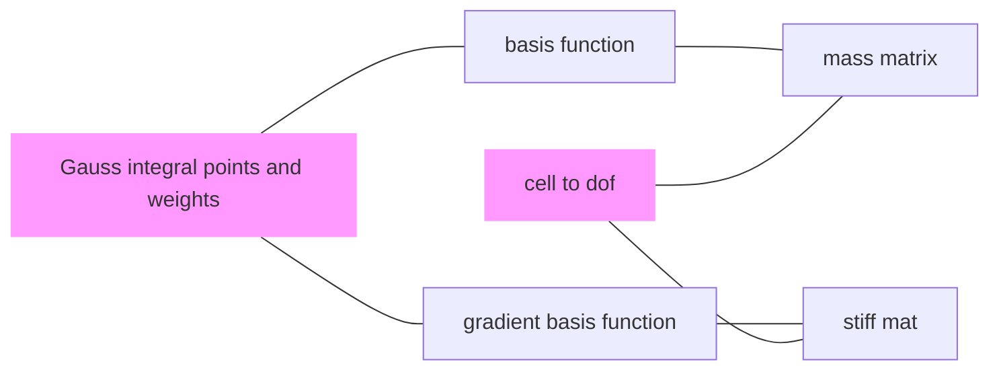

# FEALPy manual

## Procedure

The procedure of FEALPy

For example, in the `PoissonFEMRate.py`,  

The important thing is to get the 

- (Gauss) integral points and weights.
- The values of basis-functions at integral points.
- The values of gradient-basis-functions at integral points.

