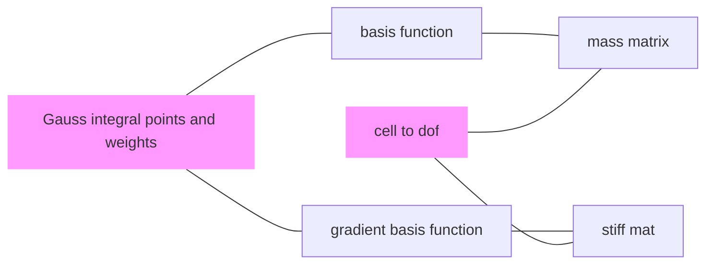

# FEALPy manual

## Procedure

The procedure of FEALPy

For example, in the `PoissonFEMRate.py`,  

The important thing is to get the 

- (Gauss) integral points and weights.
- The values of basis-functions at integral points.
- The values of gradient-basis-functions at integral points.

---

In the following $tdim, gdim \geq 2$

- `bcs`: the intergal points, the shape is `(NQ,tdim+1)`, the `NQ` means the number of intergal points; `tdim` is topology-dimension, in 2D, means $\lambda_0, \lambda_1, \lambda_2$. 
- `ws`: the corresponding Gauss weights, the shape is `(NQ,)`.
- `phi`: the shape of 'phi' can be `(NQ, ldof)`, the `ldof` is the number of local basis functions.

In the `LagrangeFiniteElementSpace.py`, defined the `grad_basis()` function which returen the `gphi`

- `gphi`: the gradient basis function values at barycentric point `bcs`, the shape of 'gphi' is `(NQ,NC,ldof,gdim)`, `NC` is the number of cells, `gdim` is the grid-dimension.

In mesh structure

- `edge2cell` is the $NE\times 4$ array
  - `edge2cell[i,0]` 和 `edge2cell[i,1]` 分别存储第 $i$ 条边左右两个单元的全局编号 (即对应 `cell` 数组中的行号)
  - `edge2cell[i,2]` 和 `edge2cell[i,3]` 分别存储第 $i$ 条边在左右两个单元中的局部编号
  - 如果是边界边, 则
    - `edge2cell[i,0] = edge2cell[i,1]` 
    - `edge2cell[i,2] = edge2cell[i,3]` 
- 

