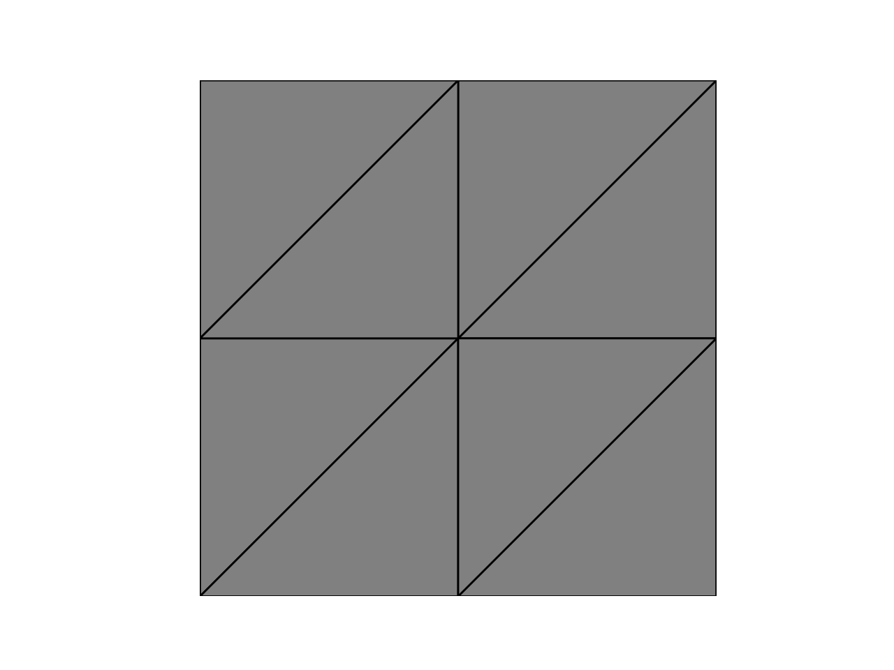

# FEALPy Basic

#### 1. 

p = int(sys.argv[2])  #  p 表示空间的分片多项式阶数，如 p=2 即采用 P2 元.

n = int(sys.argv[3]) #  n 表示网格初始化时加密的次数.


#### 2. 

in `class TriangleMesh(Mesh2d)`:

...
`N = node.shape[0]`, `node.shape` returns the numbers of rows and cols:	

```pyth
In [23]: import numpy as np
In [24]: node = np.array([
...:             (0, 0),
...:             (1, 0),
...:             (1, 1),
...:             (0, 1)], dtype=np.float)
...:             
In [25]: node.shape
Out[25]: (4, 2)
```


#### 3.

In  `lagrange_fem_space.py`, in the class `class LagrangeFiniteElementSpace()`

```python
class LagrangeFiniteElementSpace():
    def __init__(self, mesh, p=1, spacetype='C'):
        self.mesh = mesh
        self.p = p
        if len(mesh.node.shape) == 1:
            self.GD = 1
        else:
            self.GD = mesh.node.shape[1]
        if spacetype is 'C':
            if mesh.meshtype is 'interval':
                self.dof = CPLFEMDof1d(mesh, p)
                self.TD = 1
            elif mesh.meshtype is 'tri':
                self.dof = CPLFEMDof2d(mesh, p)
                self.TD = 2
            elif mesh.meshtype is 'stri':
                self.dof = CPLFEMDof2d(mesh, p)
                self.TD = 2
            elif mesh.meshtype is 'tet':
                self.dof = CPLFEMDof3d(mesh, p)
                self.TD = 3
        elif spacetype is 'D':
            if mesh.meshtype is 'interval':
                self.dof = DPLFEMDof1d(mesh, p)
                self.TD = 1
            elif mesh.meshtype is 'tri':
                self.dof = DPLFEMDof2d(mesh, p)
                self.TD = 2
            elif mesh.meshtype is 'tet':
                self.dof = DPLFEMDof3d(mesh, p)
                self.TD = 3
  ...
  ...
  ...
```

where

* `GD`: grid-dimension;
* `TD`: topology-dimension;
* `CPLFEMDof1d`: continuous piecewise Lagrange FEM Dof in 1D;
* `DPLFEMDof1d`: discontinuous piecewise Lagrange FEM Dof in 1D.


#### 4.

```python
class DPLFEMDof1d(DPLFEMDof):
    def __init__(self, mesh, p):
        super(DPLFEMDof1d, self).__init__(mesh, p)

    def multi_index_matrix(self):
        p = self.p
        ldof = self.number_of_local_dofs()
        multiIndex = np.zeros((ldof, 2), dtype=np.int)
        multiIndex[:, 0] = np.arange(p, -1, -1)
        multiIndex[:, 1] = p - multiIndex[:, 0]
        return multiIndex
```

where the usage of `super` function can be found in [Python super 函数详解](https://www.jianshu.com/p/6d7cce41dc65) and [python中的super函数及MRO](https://blog.csdn.net/m0_38063172/article/details/82250865).


#### 5. Plot the mesh

```python
import matplotlib.pyplot as plt
from fealpy.fem.PoissonFEMModel import PoissonFEMModel
from fealpy.tools.show import showmultirate, show_error_table
from fealpy.pde.poisson_2d import CosCosData as PDE

d = 2
n = 1
pde = PDE()
mesh = pde.init_mesh(n)
from fealpy.mesh.mesh_tools import unique_row, find_node, find_entity, show_mesh_2d
fig = plt.figure()
axes = fig.gca()
show_mesh_2d(axes,mesh)
plt.show()

## TODO:
find_node(axes,mesh.node,showindex=True)
```




#### 6. Get barycentric points (bcs) 

```pyth
# ------------------------------------------------- #
# --- project 1: get barycentric points (bcs)   --- #

import numpy as np
from fealpy.mesh.TriangleMesh import TriangleMesh

# init mesh
n = 1  # refine times

node = np.array([
    (0, 0),
    (1, 0),
    (1, 1),
    (0, 1)], dtype=np.float)

cell = np.array([(1, 2, 0), (3, 0, 2)], dtype=np.int)  # tri mesh

mesh = TriangleMesh(node, cell)
mesh.uniform_refine(n)

# get bcs
p = 1  # polynomial order of FEM space
q = p+3  # integration order
integrator = mesh.integrator(q)
qf = integrator
bcs, ws = qf.quadpts, qf.weights
shape = bcs.shape

print(shape)
```


