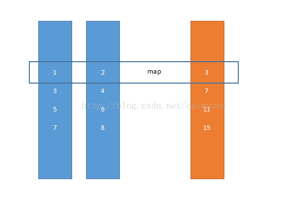

## Python `list()`, `map()`, `zip()` 函数

### `list()`函数

Python 的 `list()` 函数可以将其他数据类型转换为列表类型，并返回转换后的列表。当参数为空时，`list()` 函数可以创建一个空列表。

#### Example 1. 创建一个空列表 (无参调用 `list()` 函数)

```python
>>> test = list()
>>> test
[]
```

#### Example 2. 将字符串转换为列表

```python
>>> test = list('cat')
>>> test
['c', 'a', 't']
```

#### Example 3. 将元组转换为列表

```python
>>> a_tuple = ('I love Python.', 'I also love HTML.')
>>> test = list(a_tuple)
>>> test
['I love Python.', 'I also love HTML.']
```

#### Example 4. 将字典转换为列表

```python
>>> a_dict = {'China':'Beijing', 'Russia':'Moscow'}
>>> test = list(a_dict)
>>> test
['China', 'Russia']
```

**注意：将字典转换为列表时，会将字典的值舍去，而仅仅将字典的键转换为列表。如果想将字典的值全部转换为列表，可以考虑使用字典方法 `dict.values()`**

#### Example 5. 将集合转换为列表

```python
>>> a_set = {1, 4, 'sdf'}
>>> test = list(a_set)
>>> test
[1, 'sdf', 4]
```

#### Example 6. 将其他可迭代序列转化为列表

下面的代码将 range 类型和 map 类型的可迭代序列转换为列表：

```python
>>> test1 = list(range(10))
>>> test2 = list(map(int, [23.2, 33.1]))
>>> test1
[0, 1, 2, 3, 4, 5, 6, 7, 8, 9]
>>> test2
[23, 33]
```


#### 注意事项

1. ##### 参数必须是可迭代序列对象

   `list()` 函数的参数必须是可迭代对象。当选用不可迭代的对象作为参数时，Python 报错。

   ```python
   >>> test = list(12)
   Traceback (most recent call last):
     File "<stdin>", line 1, in <module>
   TypeError: 'int' object is not iterable
   ```

2. ##### 无意义的转换---将列表转换为列表

   可以使用 `list()` 函数将列表转换为一个列表，虽然这么做Python不会有任何的异常或者报错----但是这种行为显然是没有意义且浪费资源的行为。

   ```python
   >>> a_list = ['Python', 'C', 'Java', 'HTML', 'CSS']
   >>> test = list(a_list)
   >>> test
   ['Python', 'C', 'Java', 'HTML', 'CSS']
   ```


### `map()` 函数

其实 `map()` 函数就是一个数据集到另一个数据集的映射的关系，中间并没有减少，或增加元素的。因此在 Python 里，`map()` 函数就是把**所有列表对象里的元素，按顺序取出来**，然后放进函数里进行操作，计算出来结果。它是一个**并行**的关系，并没有减少元素。

首先最终返回结果：

- Python 2.x 返回列表；
- Python 3.x 返回迭代器，**迭代器只能前进，不能后退**，比如说测试一的代码，在 `for` 循环结束的时候，迭代器的内部指针已经指向了内部的最后一个元组，然后到了下面执行列表生成式的时候，迭代器只能前进不能后退，所以指针没有被重置，可是迭代器已经没有元组可返回了，所以打印出来的是 `空列表 (即 [])`。我们在下面的例子中也会说明。

如何理解这个**并行**，可以看下面例子可以很容易的理解

```python
>>> def sumfunc(x, y):
...     return x + y
... 
>>> list1 = [1, 3, 5, 7]
>>> list2 = [2, 4, 6, 8]
>>> result = map(sumfunc, list1, list2)
>>> print([x for x in result]) # first print
[3, 7, 11, 15]
>>> print([x for x in result]) # second print
[]
```

实际的操作如下




### `zip()` 函数

#### 综述

`zip()` 函数用于将可迭代对象作为参数，将对象中对应的元素打包成一个个元组，然后返回由这些元组组成的对象。如果各个可迭代对象的元素个数不一致，则返回的对象长度与最短的可迭代对象相同。利用 `*` 号操作符，与 `zip` 相反，进行解压。

#### 语法

`zip(iterable1,iterable2, ...)`：iterable -- 一个或多个可迭代对象（字符串、列表、元祖、字典）

#### 返回值

- Python2 中直接返回一个由元组组成的列表;
- Python3 中返回的是一个 `zip` 对象，如果想要得到列表，可以用 `list()` 函数进行转换。同样需要注意的是， `zip` 对象是一个迭代器，有着上面 `map` 对象相同的性质。**迭代器只能前进，不能后退**，比如说测试一的代码，在 `for` 循环结束的时候，迭代器的内部指针已经指向了内部的最后一个元组，然后到了下面执行列表生成式的时候，迭代器只能前进不能后退，所以指针没有被重置，可是迭代器已经没有元组可返回了，所以打印出来的是 `空列表 (即 [])`。

#### 例子

下面只展示 Python3 下的例子

##### Example 1. 可迭代对象为列表

```python
>>> a = [1,2,3] #此处可迭代对象为列表
>>> b = [4,5,6]
>>> c = [4,5,6,7,8]
>>> zipped = zip(a,b)
>>> zipped
<zip object at 0x02B01B48> #返回的是一个对象
>>> list(zipped)
[(1, 4), (2, 5), (3, 6)] #使用list()函数转换为列表
>>> list(zip(a,c))
[(1, 4), (2, 5), (3, 6)]
>>> zipped = zip(a,b)
>>> list(zip(*zipped)) #解压也使用list进行转换
[(1, 2, 3), (4, 5, 6)]

```

##### Example 2. 任何可迭代对象，如：字符串、列表、元祖、字典

```python
>>> v1 = {1:11,2:22} #此处可迭代对象为字典
>>> v2 = {3:33,4:44}
>>> v3 = {5:55,6:66}
>>>  
>>> v = zip(v1,v2,v3)   #压缩
>>> print(list(v))
[(1, 3, 5), (2, 4, 6)]
>>>
>>> w = zip(*zip(v1,v2,v3)) #解压
>>> print(list(w))
[(1, 2), (3, 4), (5, 6)]
```

##### Example 3. 搭配 `for` 循环支持并行迭代：

```python
>>> list1 = [2,3,4]
>>> list2 = [4,5,6]
>>> for x,y in zip(list1,list2):
...     print(x,y,'--',x*y)
... 
2 4 -- 8
3 5 -- 15
4 6 -- 24
```


### `list()`,`zip()`, `map()` 函数联用

仍然看 `map()` 函数中的例子，不过下面用 `lambda()` 函数来代替显示声明的 `sumfunc()` 函数，并用 `zip()` 函数打包参数列表，最后

```python
>>> sumfunc = lambda x: x[0]+x[1]
>>> list1 = [1, 3, 5, 7]
>>> list2 = [2, 4, 6, 8]
>>> res = map(sumfunc, zip(list1, list2))
>>> res
<map object at 0x10ea33ba8>
>>> list(res) # first use
[3, 7, 11, 15]
>>> list(res) # second use
[]
```

