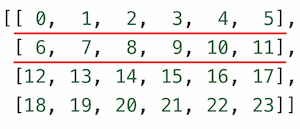
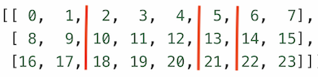

## numpy.split, numpy.hsplit, numpy.vsplit

1. split

   `numpy.split(ary, indices_or_sections, axis)`

   - ary: 被分割的输入数组;
   - indices_or_sections: 可以是整数, 表明要分割的子数组的数量.  如果此参数是一维数组, 则表明分割点下标;
   - axis: 默认为 0;

   ```python
   >>> arr = np.arange(24).reshape(4,6)
   >>> arr
   array([[ 0,  1,  2,  3,  4,  5],
          [ 6,  7,  8,  9, 10, 11],
          [12, 13, 14, 15, 16, 17],
          [18, 19, 20, 21, 22, 23]])
   >>>
   >>> r = np.split(arr,[1,2])
   >>> r[0]
   array([[0, 1, 2, 3, 4, 5]])
   >>> r[1]
   array([[ 6,  7,  8,  9, 10, 11]])
   >>> r[2]
   array([[12, 13, 14, 15, 16, 17],
          [18, 19, 20, 21, 22, 23]])
   ```

   如上的例子中, 因为省略了 `axis`, 所以默认 `axis=0`, 其中分割如下

   

   

2. hsplit、vsplit

   `numpy.hsplit` 是 `split()` 函数的特例, 其中轴为 1 表示水平分割, 无论输入数组的维度是什么. 
   `numpy.vsplit` 是 `split()` 函数的特例, 其中轴为 0 表示竖直分割, 无论输入数组的维度是什么.

   下面以 `hsplit` 举例

   ```python
   >>> arr = np.arange(24).reshape(3,8)
   >>> arr
   array([[ 0,  1,  2,  3,  4,  5,  6,  7],
          [ 8,  9, 10, 11, 12, 13, 14, 15],
          [16, 17, 18, 19, 20, 21, 22, 23]])
   >>> 
   >>> r = np.hsplit(arr, [2,5,6])
   >>> len(r)
   4
   >>>
   >>> r[0]
   array([[ 0,  1],
          [ 8,  9],
          [16, 17]])
   >>> r[1]
   array([[ 2,  3,  4],
          [10, 11, 12],
          [18, 19, 20]])
   >>> r[2]
   array([[ 5],
          [13],
          [21]])
   >>> r[3]
   array([[ 6,  7],
          [14, 15],
          [22, 23]]) 
   ```

   上例中对数组的分割如下

   