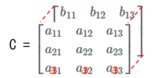
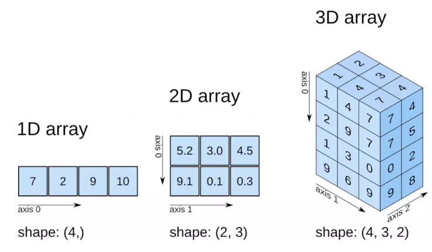

## NumPy 中 数组的维数理解

### 不同形式的构造向量

```python
>>> c = np.array([[2,1,3]])
>>> c
array([[2, 1, 3]])
>>> c.shape
(1, 3)
>>> c.ndim
2
>>>
>>> d = a = np.array([0, 1, 2, 3, 4])
>>> d
array([0, 1, 2, 3, 4])
>>> d.shape
(5,)
>>> d.ndim
1
>>>
>>> v = np.array([[2],[1],[3]])
>>> v
array([[2],
       [1],
       [3]])
>>> v.shape
(3, 1)
>>> v.ndim
2
```


### 三维数组的维数，切片

```python
>>> import numpy as np
>>> a = np.arange(24).reshape(2,3,4)
>>> a
array([[[ 0,  1,  2,  3],
        [ 4,  5,  6,  7],
        [ 8,  9, 10, 11]],

       [[12, 13, 14, 15],
        [16, 17, 18, 19],
        [20, 21, 22, 23]]])
>>> a[1,...]
array([[12, 13, 14, 15],
       [16, 17, 18, 19],
       [20, 21, 22, 23]])
>>> a[1,:,:]
array([[12, 13, 14, 15],
       [16, 17, 18, 19],
       [20, 21, 22, 23]])
>>> a[1,:,1]
array([13, 17, 21])
>>> a[:,:,1]
array([[ 1,  5,  9],
       [13, 17, 21]])
>>>       
>>>
>>> a
array([[[ 0,  1,  2,  3],
        [ 4,  5,  6,  7],
        [ 8,  9, 10, 11]],

       [[12, 13, 14, 15],
        [16, 17, 18, 19],
        [20, 21, 22, 23]]])
>>> a.sum(axis=0)
array([[12, 14, 16, 18],
       [20, 22, 24, 26],
       [28, 30, 32, 34]])
>>> a.sum(axis=1)
array([[12, 15, 18, 21],
       [48, 51, 54, 57]])
>>> a.sum(axis=2)
array([[ 6, 22, 38],
       [54, 70, 86]])
```

---

三维的 `array` 切片如下图 (这个图有点问题, 考虑重新画)



其中

-  `axis=0` 的轴是 $$a_{11}, b_{11}$$,
-   `axis=1` 的轴是  $$a_{11}, a_{21}, a_{31}$$, 
-   `axis=2` 的轴是  $$.a_{11}, a_{12}, a_{13}$$


更加准确的图如下



