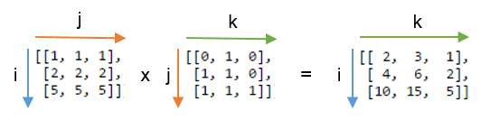
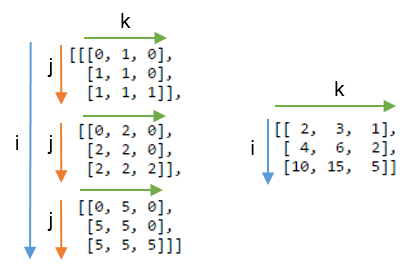
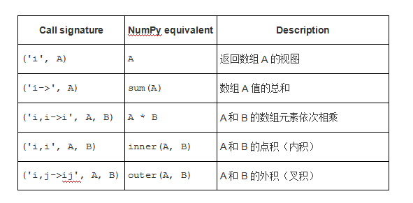
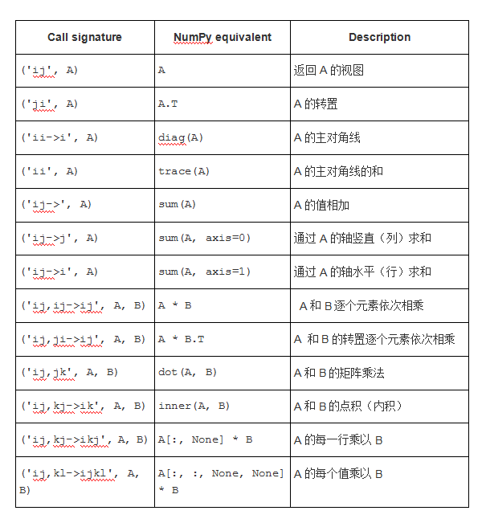

## NumPy 中 einsum 的基本介绍

See: [NumPy中einsum的基本介绍](http://www.atyun.com/32288.html)

einsum函数是NumPy的中最有用的函数之一。由于其强大的表现力和智能循环，它在速度和内存效率方面通常可以超越我们常见的array函数。但缺点是，可能需要一段时间才能理解符号，有时需要尝试才能将其正确的应用于棘手的问题。

关于Stack Overflow这样的网站上有很多关于einsum是什么，以及它如何工作的问题，所以这篇文章希望对这个函数的进行基本介绍，并且让你了解开始使用它时需要知道的内容。

### 什么是 einsum 呢

使用einsum函数，我们可以使用爱因斯坦求和约定（Einstein summation convention）在NumPy数组上指定操作。

假设我们有两个数组，A和B。现在假设我们想要：

- 用一种特殊的方法将A和B相乘来创建新的乘积的数组，然后可能
- 沿特定轴求和这个新数组，
- (和/或) 按特定顺序转置数组的轴。

这样一来，einsum允许组合相乘，相加和转置等numpy函数帮助我们更快、更高效的完成任务。

举一个函数的一个小例子，这里有两个数组，我们想要逐个元素相乘，然后沿轴1（数组的行）求和：

```python
A = np.array([0, 1, 2])

B = np.array([[ 0,  1,  2,  3],
              [ 4,  5,  6,  7],
              [ 8,  9, 10, 11]])
```

我们通常如何在NumPy中执行此操作？首先要注意的是我们需要reshapeA，这样我们在乘B时才可以广播（就是说，A需要是列向量）。然后我们可以用B的第一行乘以0，第二行乘以1，第三行乘以2。这样我们得到一个新数组，然后可以对新数组的三行进行求和。

也就是说，我们有：

```python
>>> (A[:, np.newaxis] * B).sum(axis=1)
array([ 0, 22, 76])
```

这没什么问题，但如果使用einsum，我们可以做得更好：

```python
>>> np.einsum('i,ij->i', A, B)
array([ 0, 22, 76])
```

为什么更好？简而言之，因为我们根本不需要对A进行reshape，最重要的是，乘法不会创建像A[:, np.newaxis] * B这样的临时数组。相反，einsum只需沿着行对乘积进行求和。即使是这个小的例子，einsum也要快三倍。

### 如何使用einsum

关键是为输入数组的轴和我们想要输出的数组选择正确的标签。

函数使我们可以选择两种方式之一执行此操作：使用字符串或使用整数列表。为简单起见，我们将坚持使用字符串（这也是更常用的）。

一个很好的例子是矩阵乘法，它将行与列相乘，然后对乘积结果求和。对于两个二维数组 `A` 和 `B`，矩阵乘法操作可以用 `np.einsum('ij,jk->ik', A, B)` 完成。

这个字符串是什么意思？想象 `'ij,jk->ik'` 在箭头 `->` 处分成两部分。左侧部分标记输入数组的轴：`'ij'` 标记 `A` 和 `'jk'` 标记 `B`。字符串的右侧部分用字母 `'ik'` 标记单个输出数组的轴。也就是说，我们正在传入两个二维数组，获取一个新的二维数组。

我们要相乘的两个数组是：

```python
A = np.array([[1, 1, 1],
              [2, 2, 2],
              [5, 5, 5]])

B = np.array([[0, 1, 0],
              [1, 1, 0],
              [1, 1, 1]])
```

我们的矩阵乘法 `np.einsum('ij,jk->ik', A, B)` 大致如下：



要了解输出数组的计算方法，请记住以下三个规则：

- 在输入数组中重复的字母意味着值沿这些轴相乘。乘积结果为输出数组的值。

  在本例中,我们使用字母j两次：A和B各一次。这意味着我们将A每一行与B每列相乘。这只在标记为j的轴在两个数组中的长度相同（或者任一数组长度为1）时才有效。

- 输出中省略的字母意味着沿该轴的值将相加。

  在这里，j不包含在输出数组的标签中。通过累加的方式将它从轴上除去，最终数组中的维数减少1。如果输出是’ijk’，我们得到的结果是3x3x3数组（如果我们不提供输出标签，只写箭头，则对整个数组求和）。

- 我们可以按照我们喜欢的任何顺序返回未没进行累加的轴。

  如果我们省略箭头 `->`，NumPy 会将只出现一次的标签按照字母顺序排列（因此实际上 `'ij,jk->ik'` 相当于 `ij,jk`）。如果我们想控制输出的样子，我们可以自己选择输出标签的顺序。例如，`ij,jk->ki` 为矩阵乘法的转置。

现在，我们已经知道矩阵乘法是如何工作的。下图显示了如果我们不对j轴进行求和，而是通过写 `np.einsum(‘ij,jk->ijk’, A, B)` 将其包含在输出中，我们会得到什么。右边代表 `j` 轴已经求和：



注意，由于 `np.einsum(‘ij,jk->ik’, A, B)` 函数不构造 3 维数组然后求和，它只是将总和累加到 2 维数组中。

### 一些简单的操作

这就是我们开始使用einsum时需要知道的全部内容。知道如何将不同的轴相乘，然后如何对乘积求和，我们可以迅速而简单地表达许多不同的操作。这使我们可以相对容易地将问题推广到更高维度。例如，我们不必插入新的轴或转置数组以使它们的轴正确对齐。

下面是两个表格展示了 einsum 如何进行各种 NumPy 操作。我们可以用它来熟悉符号。

让A和B是两个形状兼容的一维数组（也就是说，我们相应的轴的长度要么相等，要么其中一个长度为1）：



现在，我们A和B是与之兼容形状的两个二维数组：



当处理大量维度时，别忘了einsum允许使用省略号语法’…’。这提供了一种变量的方式标记我们不大感兴趣的轴，例如 `np.einsum(‘…ij,ji->…’, a, b)`，仅将 `a` 的最后两个轴与 2 维数组 `b` 相乘。

### 注意事项

本节说一些使用该函数时要注意的东西。

einsum在求和时不会推广（promote）数据类型。如果你使用的是更有限的数据类型，则可能会出现意外结果：

```python
>>> a = np.ones(300, dtype=np.int8)
>>> np.sum(a) # correct result
300
>>> np.einsum('i->', a) # produces incorrect result
44
```

einsum也可能不按顺序排列轴。文档重点强调了np.einsum(‘ji’, M)是一种转换2维数组的方法。你认为对于一个3维数组，np.einsum(‘kij’, M)将最后一个轴移动到第一个位置并移动前两个轴到后面去是情有可原的。实际上，einsum通过按字母顺序重新排列标签来创建自己的输出标签。所以，’kij’才变成了’kij->ijk’，我们有反向排列取代。

最后，einsum并不总是NumPy中最快的选择。如函数dot和inner经常链接到BLAS例程可以超越einsum在速度方面，tensordot函数也可以与之相比。如果你四处搜索下，就会发现有些帖子的例子einsum似乎很慢，特别是在操作数个输入数组时（例如：https://github.com/numpy/numpy/issues/5366）

可能感兴趣的另外三个链接：

- 官方文档：http://docs.scipy.org/doc/numpy-1.10.0/reference/generated/numpy.einsum.html
- GitHub：https://github.com/numpy/numpy/blob/master/numpy/core/src/multiarray/einsum.c.src
- Stack Overflow：http://stackoverflow.com/questions/tagged/numpy-einsum


