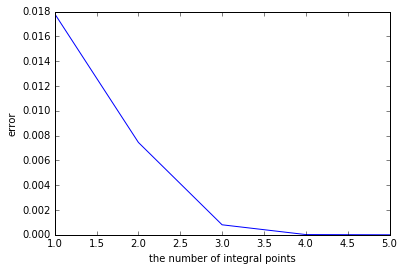

# 多边形单元上的数值积分

## 问题描述

给定一个多边形 $E$ 和 定义在 $E$ 上的函数 $f(\mathbf x)$，其中 $\mathbf x = (x, y)\in E$,  利用数值积分计算:

$$
\int_E f(\mathbf x) \mathrm d \mathbf x
$$

* $f(\mathbf x)$ 是一个齐次（homogeneous）函数
* $E$ 是一个凸或凹的多边形

## 存在方法

* Triangulation
* Divergence theorem
* Moment fitting


## 齐次函数

### 什么是齐次函数

设 $$f(\mathbf{x})$$ 是 $$q$$ 次齐次多项式，即有
$$
f(\lambda\mathbf x) = \lambda^qf(\mathbf x),\quad \forall \lambda > 0
$$

记 $ \mathbf y = \lambda \mathbf x $, 上式对 $\lambda$ 求导

$$
\begin{align}
q\lambda^{q-1}f(\mathbf x) &= (\partial_{y_1}f(\mathbf y)) (\frac{\partial y_1}{\partial \lambda}) + (\partial_{y_2}f(\mathbf y)) (\frac{\partial y_2}{\partial \lambda})\\
&= \nabla_{\mathbf y}f \cdot\frac{\partial\mathbf y}{\partial \lambda} \\
&=\nabla_{\mathbf y}f \cdot \mathbf x
\end{align}
$$

取 $\lambda = 1$, 可得：
$$
qf(\mathbf x) = \nabla f(\mathbf x)\cdot\mathbf x
$$

例如 $$2$$ 次齐次多项式
$$
\begin{align}
f(x,y) &= x^2 + y^2 \\
f(\lambda x,\lambda y) &= (\lambda x)^2 +  (\lambda y)^2 = \lambda^2 f(x, y)
\end{align}
$$


### 为什么引入齐次多项式

因为在有限元框架计算下，基函数都是齐次多项式，例如

- $$2$$ 维下 $$DG$$ 常用的基函数：
  $$
  1,\ x_1,\ x_2,\ x_1^2,\ x_1x_2,\ x_2^2\ ...
  $$
  
- The scaled $$2D$$ monomial polynomials on polygon $$E$$. Set the multi-index: $$\pmb{\alpha} = (\alpha_1, \alpha_2)$$ with the usual notation $$|\pmb{\alpha}|=\alpha_1+\alpha_2$$. If $$\mathbf{x}=(x_1,x_2)$$, then $$\mathbf{x}^{\pmb{\alpha}}=x_1^{\alpha_1}x_2^{\alpha_2}$$. We will denote by $$m_{\pmb{\alpha}}$$ the scaled monomial of degree equal to $$|\pmb{\alpha}|$$ defined by
  $$
  m_{\pmb{\alpha}}:= \Big(\frac{\mathbf{x}-\mathbf{x}_E}{h_E}\Big)^{\pmb{\alpha}} = \Big(\frac{x_1-x_{1E}}{h_E}\Big)^{\alpha_1}\Big(\frac{x_2-x_{2E}}{h_E}\Big)^{\alpha_2}.
  $$
  Where $$\mathbf{x}_E$$ is the barycenter of $$E$$, which is defined by $$\mathbf{x}_E = \frac{1}{|E|} \int_E\mathbf{x} \,\mathrm d\mathbf{x}$$. 

  From the definition of $$m_{\pmb{\alpha}}$$, we know that $$m_{\pmb{\alpha}}$$ is the $$|\pmb{\alpha}|$$ **homogeneous polynomial**.


### 多边形 $$E$$ 上积分

#### 一般函数

多边形 $$E$$，假设它有 $$n$$ 个按逆时针排序的顶点 $$\{\mathbf{x}_i\}_{i=0}^{n-1}$$ , $$n$$ 条边 $$\{e_i:=(\mathbf{x}_i,\mathbf{x}_{i+1})\}_{i=0}^{n-1}$$  (注意这里假定 $$\mathbf{x}_n = \mathbf{x}_0$$)，第 $$i$$ 条边  $$e_i$$ 上的单位外法向量记为 $$\mathbf{n}_i$$。给定一个定义在多边形 $E$ 上的 $$q$$ 次齐次函数 $$f(\mathbf x)$$, 记 
$$
\mathbf F: = \mathbf x f(\mathbf x)
$$

代入散度定理公式

$$
\int_E\nabla\cdot\mathbf F \mathrm d \mathbf x = \int_{\partial E} \mathbf F\cdot \mathbf n\mathrm ds
$$

所以可得

$$
\begin{align}
\int_{\partial E} (\mathbf x\cdot \mathbf n)  f(\mathbf x)\mathrm ds =& \int_E\nabla\cdot[\mathbf x f(\mathbf x)]\mathrm d \mathbf x \\
=& \int_E (\nabla\cdot\mathbf x)f(\mathbf x)\mathrm d \mathbf x + 
\int_E \mathbf x\cdot \nabla f(\mathbf x)\mathrm d \mathbf x\\
=& 2 \int_E f(\mathbf x)\mathrm d \mathbf x + 
\int_E qf(\mathbf x)\mathrm d \mathbf x\\
=& (q+2) \int_E f(\mathbf x)\mathrm d \mathbf x \\
\end{align}
$$

另一方面
$$
\begin{align}
\int_{\partial E} (\mathbf x\cdot \mathbf n)  f(\mathbf x)\mathrm ds =& \sum_{e_i\in\partial E}\int_{e_i} (\mathbf x\cdot \mathbf n_i)  f(\mathbf x)\mathrm ds\\
=& \sum_{e_i\in\partial E}\int_{e_i} [(\mathbf x - \mathbf x_i + \mathbf x_i)\cdot \mathbf n_i] f(\mathbf x)\mathrm ds\\
=& \sum_{e_i\in\partial E}\int_{e_i} (\mathbf x_i\cdot \mathbf n_i)  f(\mathbf x)\mathrm ds\\
=& \sum_{e_i\in\partial E}(\mathbf x_i\cdot \mathbf n_i)\int_{e_i} f(\mathbf x)\mathrm ds\\
\end{align}
$$
最后我们可以到得到 $$(q+2) \int_E f(\mathbf x)\mathrm d \mathbf x = \sum_{e_i\in\partial E}(\mathbf x_i\cdot \mathbf n_i)\int_{e_i} f(\mathbf x)\mathrm ds$$，即
$$
\int_E f(\mathbf x)\mathrm d \mathbf x = \frac{1}{(q+2)} \sum_{e_i\in\partial E}(\mathbf x_i\cdot \mathbf n_i)\int_{e_i} f(\mathbf x)\mathrm ds .
$$


#### The scaled $$2D$$ monomial polynomials on polygon $$E$$

For convenience, we still use $$q$$ as the **total polynomial index**, and set 

- $$f(\mathbf x) = \mathbf x^{\mathbf q} $$, and $$|\mathbf q| = q$$, 

which means that  that $$f(\mathbf x)$$ is the $$q$$-homogeneous polynomial function.

We know that translation (平移) does not change the value of the integral, so we have
$$
\int_E f(\mathbf x - \mathbf x_E)\mathrm d \mathbf x = \frac{1}{(q+2)} \sum_{e_i\in\partial E}((\mathbf x_i - \mathbf x_E)\cdot \mathbf n_i)\int_{e_i} f(\mathbf x - \mathbf x_E)\mathrm ds ,
$$
and because $$f(\mathbf x)$$ is the $$q$$-homogeneous polynomial function, we have $$\frac{1}{(h_E)^q}f(\mathbf x - \mathbf x_E) = f(\frac{\mathbf x - \mathbf x_E}{h_E})$$, thus,
$$
\int_E f(\frac{\mathbf x - \mathbf x_E}{h_E})\mathrm d \mathbf x = \frac{1}{(q+2)} \sum_{e_i\in\partial E}((\mathbf x_i - \mathbf x_E)\cdot \mathbf n_i)\int_{e_i} f(\frac{\mathbf x - \mathbf x_E}{h_E})\mathrm ds ,
$$
i.e.,
$$
\int_E \Big(\frac{\mathbf x - \mathbf x_E}{h_E}\Big)^{\mathbf q}\mathrm d \mathbf x = \frac{1}{(q+2)} \sum_{e_i\in\partial E}((\mathbf x_i - \mathbf x_E)\cdot \mathbf n_i)\int_{e_i} \Big(\frac{\mathbf x - \mathbf x_E}{h_E}\Big)^{\mathbf q} \mathrm ds ,
$$
this gives us the integral formula for The scaled $$2D$$ monomial polynomials on polygon $$E$$.

# Gauss 积分

**代数精度** $\quad$ 如果求积公式 $\int_{a}^{b}f(x)\mathrm dx\thickapprox \sum_{k=0}^{n}A_kf(x_k)$, 对所有次数小于等于 $m$ 的多项式是精确的, 但对 $m+1$ 次多项式不精确, 则称其具有 $m$ 次代数精度.

**利用正交多项式构造Gauss求积公式**

设 $P_{n}(x),n = 0,1,2\dots$ 为正交多项式序列, $P_n(x)$ 具有以下性质:
* 对每个 $n$, $P_n(x)$ 是 $n$ 次多项式, $n = 0,1,2\dots$
* $\int_{a}^{b}\rho(x)p_i(x)p_j(x) \mathrm dx = 0$
* 对任意一个次数小于等于 $n-1$ 的多项式 $P(x)$ ,有 $\int_{a}^{b}\rho(x)p(x)P_n(x) \mathrm dx = 0$, $n\geq 1$
* $P_n(x)$ 在 $(a,b)$ 内有 $n$ 个互异的零点.

**定理** $\quad$ 设 $x_0,x_1,\dots,x_n$ 是 $n+1$ 次正交多项式 $P_{n+1}(x)$ 的 $n+1$ 个零点, 则插值型求积公式

$$
\int_{a}^{b}\rho(x)f(x)\mathrm dx = \sum_{k=0}^{n}A_kf(x_k)+R_n
$$

$$
A_k = \int_{a}^{b}\rho(x)\Pi_{i=0,i\neq k}^{n}\frac{x-x_i}{x_k-x_i}\mathrm dx
$$

$$
R_n = \frac{1}{(n+1)!}\int_{a}^{b}f^{(n+1)}(\xi(x))\omega_{n+1}(x)\rho(x)\mathrm dx
$$

是 Gauss 型求积公式.这里 $\omega_{n+1}(x)$ 是以节点 $x_i(i = 0,1,\dots,n)$ 为零点的 $n+1$ 次多项式.

**注:**　$n+1$ 次 Legrendre 多项式为

$$
P_{n+1}(x) = \frac{1}{(n+1)!2^{n+1}}\frac{d^{n+1}}{dx^{n+1}}(x^2-1)^{n+1},\quad x\in[-1,1],\quad n = 0,1,2\dots
$$

其具有性质:
* $n+1$ 次 Legrendre 多项式y与任意不超过 $n$ 次的多项式在区间 $[-1,1]$ 上正交
* $n+1$ 次 Legrendre 多项式的 $n+1$ 个零点都在区间 $[-1,1]$ 内

**利用正交多项式构造 Gauss 求积公式的基本步骤**

* 以 $n+1$ 次正交多项式的零点 $x_0,x_1,x_2,\dots,x_n$ 作为积分点（Gauss点）
* 用 Gauss 点对 $f(x)$ 作 Lagrange 插值多项式 $f(x)\thickapprox \sum_{k=0}^{n}l_k(x)f(x_k)$，这里 $l_k(x) = \Pi_{i=0,i\neq k}^{n}\frac{x-x_i}{x_k-x_i}$


在区间 $[-1,1]$ 内函数 $f(x)$ 的 Gauss-Legrendre 积分:

$$
\int_{-1}^{1}f(x)\mathrm dx =  \sum_{i=1}^{n}A_if(x_i)
$$

其中 $x_i$ 是高斯点, $A_i = \int_{a}^{b}l_i(x)\mathrm dx,i = 0,1,2,\dots,n$ 是权重.

作变换 $x = \frac{a+b}{2}+\frac{b-a}{2}t$ ,即可得到将区间 $[a,b]$ 变换到 $[-1,1]$ 上,所以在任意区间 $[a,b]$ 上函数 $f(x)$ 的 Gauss-Legrendre 积分:

$$
\begin{align}
\int_{a}^{b}f(x)\mathrm dx 
&= \frac{b-a}{2} \int_{-1}^{1}f(\frac{b-a}{2}x+\frac{a+b}{2})\mathrm dx\\
& = \frac{b-a}{2}\sum_{i=1}^{n}A_if(\frac{b-a}{2}x_i+\frac{a+b}{2})
\end{align}
$$

|积分点的个数 $n$ |积分点 $x_i$ | 权重  $A_i$ |
|:--------:|:---------:|:--------:|
|0  | 0 |2 |
|1  | $\pm 0.5773503$ |1 |
|2  | $\pm 0.7745967$ |0.5555556 |
|2  | 0 |0.8888889 |
|3  | $\pm 0.8611363$ |0.3478548 |
|3  | $\pm 0.3399810$ |0.6521452 |
|4  | $\pm 0.9061798$ |0.2369269 |
|4  | $\pm 0.5384693$ |0.4786287 |
|4  | 0 |0.5688889 |
|5  | $\pm 0.9324695$ |0.1713245 |
|5  | $\pm 0.6612094$ |0.3607616 |
|5  | $\pm 0.2386192$ |0.4679139 |

# Gauss–Lobatto rules

它与高斯积分相似，具有以下区别:
* 积分点包括积分区间的终点
* 多项式达到次数是 $2n-3$ 时是精确的, 其中n是积分点的数量

在区间 $[-1,1]$ 内函数 $f(x)$ 的 Lobatto 积分:

$$
\int_{-1}^{1}f(x)\mathrm dx = \frac{2}{n(n-1)}[f(1)+f(-1)] + \sum_{i=2}^{n-1}\omega_if(x_i) + R_n
$$

其中 $x_i$ 是 $P'_{n-1}(x)$ 的 第 $i-1$ 个零点, $\omega_i$ 是权重, $R_n$ 是余项.

权重:

$$
\omega_i = \frac{2}{n(n-1)[P_{n-1}(x_i)]^2},\qquad x_i \neq \pm 1
$$

这里 $P_{n-1}(x)$ 是 $n-1$ 次 Legrendre 多项式.

余项:

$$
R_n = \frac{-n(n-1)^32^{2n-1}[(n-2)!]^4}{(2n-1)[(2n-2)!]^3}f^{2n-2}(\xi),\qquad -1<\xi<1
$$

一些权重:

|积分点的个数 $n$ |$x_i$ | 权重  $\omega_i$ |
|:--------:|:---------:|:--------:|
|3  | 0 |$\frac{4}{3}$ |
|3  | $\pm 1$ |$\frac{1}{3}$ |
|4  | $\pm\sqrt{\frac{1}{5}}$ |$\frac{5}{6}$ |
|4  | $\pm 1$ |$\frac{1}{6}$ |
|5  | $0$ |$\frac{32}{45}$ |
|5  | $\pm\sqrt{\frac{3}{7}}$ |$\frac{49}{90}$ |
|5  | $\pm 1$ |$\frac{1}{10}$ |
|6  | $\pm\sqrt{\frac{1}{3}-\frac{2\sqrt{7}}{21}}$ |$\frac{14+\sqrt{7}}{30}$ |
|6  | $\pm\sqrt{\frac{1}{3}+\frac{2\sqrt{7}}{21}}$ |$\frac{14-\sqrt{7}}{30}$ |
|6  | $\pm 1$ |$\frac{1}{15}$ |
|7  | $0$ |$\frac{256}{525}$ |
|7  | $\pm\sqrt{\frac{5}{11}-\frac{2}{11}\sqrt{\frac{5}{3}}}$ |$\frac{124+7\sqrt{15}}{350}$ |
|7  | $\pm\sqrt{\frac{5}{11}+\frac{2}{11}\sqrt{\frac{5}{3}}}$ |$\frac{124-7\sqrt{15}}{350}$ |
|7  | $\pm 1$ |$\frac{1}{21}$ |

## 数值实验


```python
import numpy as np 
from fealpy.mesh.TriangleMesh import TriangleMesh
from fealpy.quadrature.IntervalQuadrature import IntervalQuadrature
from fealpy.quadrature.TriangleQuadrature import TriangleQuadrature
from meshpy.triangle import MeshInfo, build

import matplotlib.pyplot as plt 
%matplotlib inline
from pylab import *

def polygon_mesh(points, h):
    ## 设置初始网格信息
    N = points.shape[0]
    facets = np.zeros((N, 2), dtype=np.int)
    facets[:, 0] = range(N)
    facets[0:-1, 1] = range(1, N)
    mesh_info = MeshInfo()
    mesh_info.set_points(points)
    mesh_info.set_facets(facets.tolist())

    ## 生成网格
    mesh = build(mesh_info, max_volume=h**2)

    ## 转化为 Fealpy 数据结构
    point = np.array(mesh.points, dtype=np.float)
    cell = np.array(mesh.elements, dtype=np.int)
    tmesh = TriangleMesh(point, cell)

    return tmesh 

def exact_quad(f):
    tmesh = polygon_mesh(f.points, f.h)
    tmesh.uniform_refine(n=4)
    
    cell = tmesh.ds.cell
    point = tmesh.point 
    
    NC = tmesh.number_of_cells()
    
    qf = TriangleQuadrature(11)
    nQuad = qf.get_number_of_quad_points()
    b = np.zeros(NC, dtype=np.float)
    for i in range(nQuad):
        lam_i, w_i = qf.get_gauss_point_and_weight(i)
        p = np.einsum('j, ij...->i...', lam_i, point[cell])
        b += f(p)*w_i
    b *= tmesh.area()
    return np.sum(b)
    

def polygon_quad(f, n):
    
    qf = IntervalQuadrature(n)
    points = f.points
    N = points.shape[0]
    facets = np.zeros((N, 2), dtype=np.int32)
    facets[:, 0] = range(N)
    facets[0:-1, 1] = range(1, N)
    
    norm = points[facets[:, 1]] - points[facets[:, 0]]
    W = np.array([[0, -1], [1, 0]])
    norm = norm@W
    
    qf = IntervalQuadrature(n)
    nQuad = qf.get_number_of_quad_points()
    b = np.zeros(N, dtype=np.float)
    for i in range(nQuad):
        lam_i, w_i = qf.get_gauss_point_and_weight(i)
        p = lam_i[0]*points[facets[:, 0]] + lam_i[1]*points[facets[:, 1]]
        b += f(p)*w_i
    
    b *=np.sum(points*norm, axis=1)
    return np.sum(b)/(f.q+2)

```


```python
class Example1():
    def __init__(self, q=2, h=0.05):
        self.h = h
        self.q = q
        self.points = np.array([
                [0.0, 0.0],
                [1.0, 0.0],
                [1.0, 1.0],
                [0.0, 1.0],
            ])
    def __call__(self, p):
        x = p[:, 0]
        y = p[:, 1]
        q = self.q
        return x**q + y**q

f = Example1(q=9)
fe = exact_quad(f)
print(fe)
maxit = 5
error = np.zeros(maxit, dtype=np.float)
fn = np.zeros(maxit, dtype=np.float)
for n in range(1, maxit+1):
    fn = polygon_quad(f, n)
    error[n-1] = np.abs(fn-fe)
print(error)
print(error[:-1]/error[1:])


g = plt.figure()
axes = g.gca()
axes.set_xlim([-0.1,1.1])  
axes.set_ylim([-0.1,1.1])
axes.set_axis_off()
coord = [[0,0], [1,0], [1,1], [0,1]]
coord.append(coord[0])
xs, ys = zip(*coord)
plt.plot(xs, ys, linewidth=1.0)
plt.title('the figure of Integral area')
plt.show()

x = np.arange(1,maxit+1)
y = error
plt.plot(x,y)
xlabel('the number of integral points')
ylabel('error')
plt.show()
```

    0.2
    [  1.78267045e-02   7.44949495e-03   8.06818182e-04   1.85528757e-05
       1.13797860e-15]
    [  2.39300847e+00   9.23317684e+00   4.34875000e+01   1.63033608e+10]





```python
class Example2():
    def __init__(self, h=0.05):
        self.h = h
        self.q = 0
        self.points = np.array([
                [1.0, 1.0],
                [2.0, 1.0],
                [2.0, 2.0],
                [1.0, 2.0],
                [0.5, 1.5]
            ])
    def __call__(self, p):
        x = p[:, 0]
        y = p[:, 1]
        return np.exp(x/y)
    
f = Example2()
fe = exact_quad(f)
print(fe)
maxit = 10
error = np.zeros(maxit, dtype=np.float)
for n in range(1, maxit+1):
    fn = polygon_quad(f, n)
    error[n-1] = np.abs(fn-fe)
print(error)
print(error[:-1]/error[1:])

g = plt.figure()
axes = g.gca()
axes.set_xlim([0.5,2.1])  
axes.set_ylim([0.9,2.1])
axes.set_axis_off()
coord = [[1,1], [2,1], [2,2], [1,2], [0.5,1.5]]
coord.append(coord[0])
xs, ys = zip(*coord)
plt.plot(xs, ys,linewidth=1.0)
plt.title('the figure of Integral area')
plt.show()


x = np.arange(1,maxit+1)
y = error
plt.plot(x,y)
xlabel('the number of integral points')
ylabel('error')
plt.show()
```

    3.40370198438
    [  2.61172256e-01   2.82146087e-02   1.95577539e-03   1.18470381e-04
       6.65766744e-06   3.54879904e-07   1.81670048e-08   9.00306052e-10
       4.34527969e-11   2.07389661e-12]
    [  9.25663222  14.42630318  16.50855992  17.79457781  18.76033938
      19.53431004  20.17869896  20.71917381  20.95224839]


```python
class Example3():
    def __init__(self, h=0.05):
        self.h = h
        self.q = 2
        self.points = np.array([
                [0.0, 0.0],
                [2.0, 0.0],
                [4.0, 1.0],
                [4.0, 4.0],
                [3.0, 5.0],
                [1.0, 4.0]
            ])
    def __call__(self, p):
        x = p[:, 0]
        y = p[:, 1]
        return x*y

f = Example3()
fe = exact_quad(f)
print(fe)
maxit = 3
error = np.zeros(maxit, dtype=np.float)
for n in range(1, maxit+1):
    fn = polygon_quad(f, n)
    error[n-1] = np.abs(fn-fe)
print(error)
print(error[:-1]/error[1:])

g = plt.figure()
axes = g.gca()
axes.set_xlim([-0.1,4.1])  
axes.set_ylim([-0.1,5.1])
axes.set_axis_off()
coord = [[0,0], [2,0], [4,1], [4,4],[3,5],[1,4]]
coord.append(coord[0])
xs, ys = zip(*coord)
plt.plot(xs, ys, linewidth=1.0)
plt.title('the figure of Integral area')
plt.show()

x = np.arange(1,maxit+1)
y = error
plt.plot(x,y)
xlabel('the number of integral points')
ylabel('error')
plt.show()
```

    78.2083333333
    [  2.08333333e-01   5.68434189e-13   5.68434189e-13]
    [  3.66503876e+11   1.00000000e+00]


```python
class Example4():
    def __init__(self, h=0.05):
        self.h = h
        self.q = 2
        self.points = np.array([
                [1.0, 1.0],
                [3.0, 1.0],
                [5.0, 5.0],
                [2.0, 2.0],
                [0.0, 4.0]
            ])
    def __call__(self, p):
        x = p[:, 0]
        y = p[:, 1]
        return x*y

f = Example4()
fe = exact_quad(f)
print(fe)
maxit = 3
error = np.zeros(maxit, dtype=np.float)
for n in range(1, maxit+1):
    fn = polygon_quad(f, n)
    error[n-1] = np.abs(fn-fe)
    print(fn)
print(error)
print(error[:-1]/error[1:])

g = plt.figure()
axes = g.gca()
axes.set_axis_off()
coord = [[1,1], [3,1], [5,5], [2,2],[0,4]]
coord.append(coord[0])
xs, ys = zip(*coord)
plt.plot(xs, ys, linewidth=1.0)
plt.title('the figure of Integral area')
plt.show()

x = np.arange(1,maxit+1)
y = error
plt.plot(x,y)
xlabel('the number of integral points')
ylabel('error')
plt.show()
```

    35.0
    33.75
    35.0
    35.0
    [  1.25000000e+00   2.48689958e-13   2.55795385e-13]
    [  5.02633887e+12   9.72222222e-01]


```python
from IPython.display import display
from sympy import *
import numpy as np
init_printing()
```


```python
x, y = symbols('x, y')
f = sin(pi*x)*sin(pi*y)
f1 = f.series(x=(x, y), x0=(0, 0), n=4)
display(f1)
```


$$\sin{\left (\pi x \right )} \sin{\left (\pi y \right )}$$


